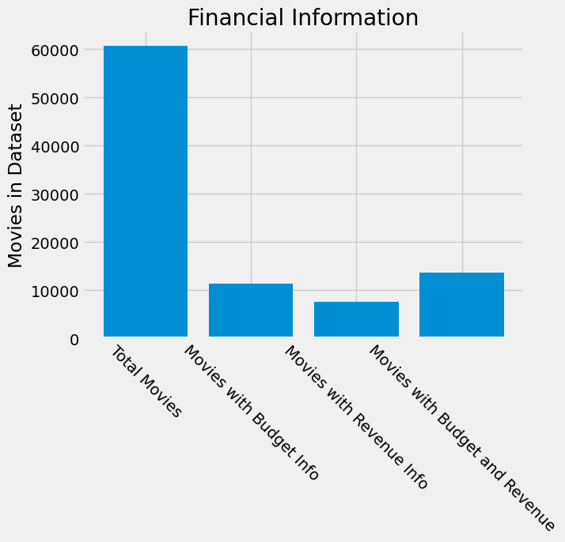
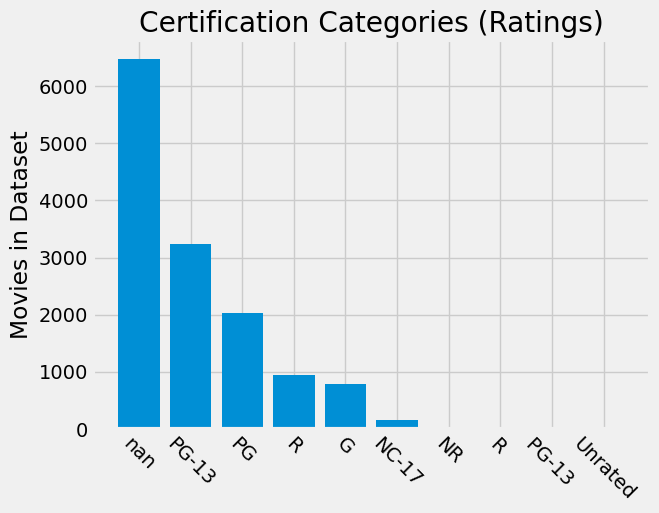
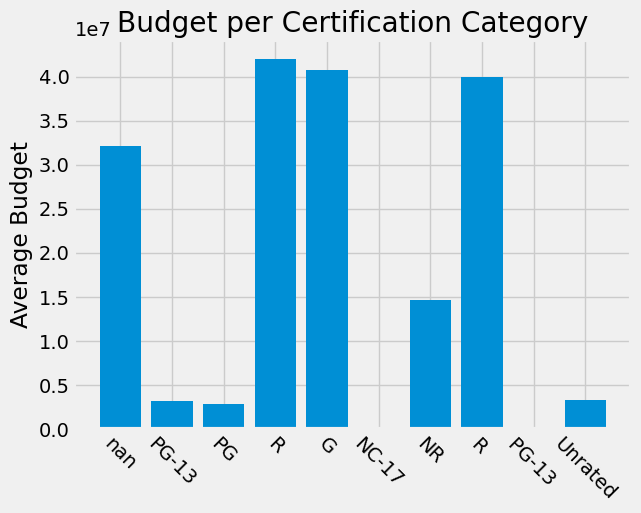
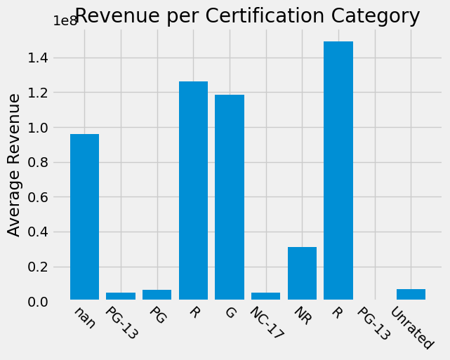
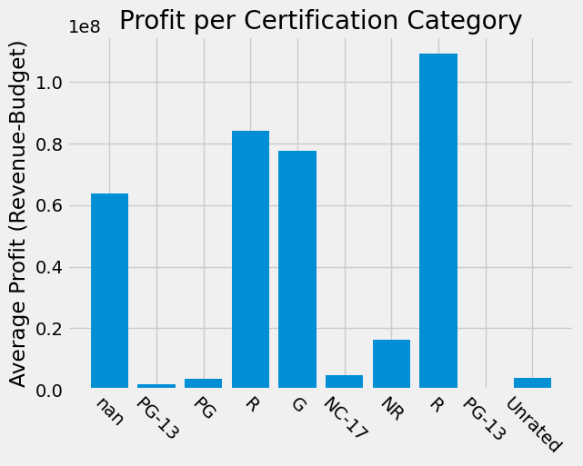
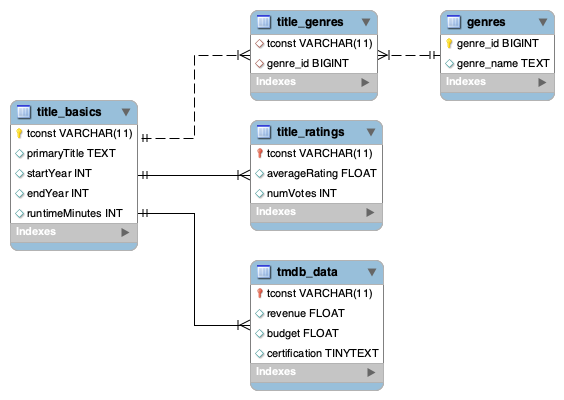

# IMDB

# Business Problem
What makes a successful movie? Can we use publicly-available data from past movies to predict the success of future
ones? To make recommendations to increase the success of future movies?

# Tasks
1. Generate a MySQL database on Movies from a subset of IMDB's publicly available dataset
2. Analyze Movie data for trends
3. Main Question: What makes a successful movie?
4. Generate a model to predict movie success

# Data Sources:
- The data used for this project will be obtained from [IMDB](https://www.imdb.com/interfaces/) and 
[TMDB](https://www.themoviedb.org/about?language=en-US)
- IMDB has several publicly-available datasets, from these the client selected three with relevant information:
    - [Basics](https://datasets.imdbws.com/title.basics.tsv.gz)- 
    As the name implies, basic information about the movies in the dataset
    - [Ratings](https://datasets.imdbws.com/title.ratings.tsv.gz)-
    Contains the IMDb rating and votes information for titles 
    - [AKAs](https://datasets.imdbws.com/title.akas.tsv.gz)-
    more information about the titles
- Other pertinent information will be queried from TMDBs public database using
 [their API](https://www.themoviedb.org/documentation/api?language=en-US)
 
# Part 1: Cleaning IMDB Data
The publicly-available data from IMDB contains many movies not relevant to this study. 
Only those movies fitting the specifications provided by the client will be included.
The specifications and procedure may be found in [IMDB_Cleaning](imdb_cleaning.ipynb)

# Part 2: TMDB Querying and EDA
TMDB API was queried using [tmdb_query.ipynb](tmdb_query.ipynb)

# Part 3: Creating a MySQL Database

